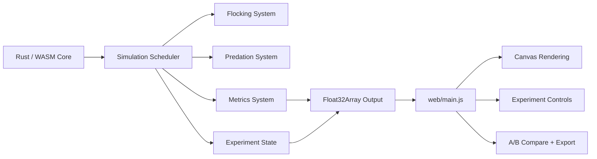
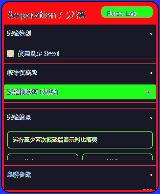
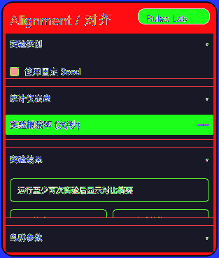
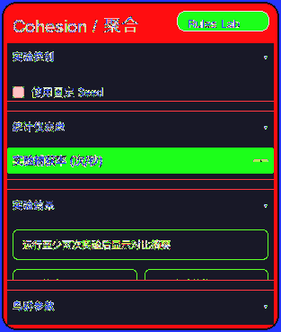
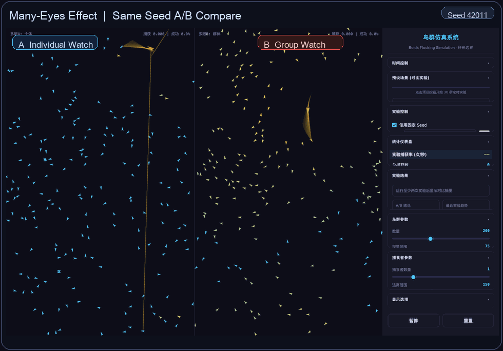
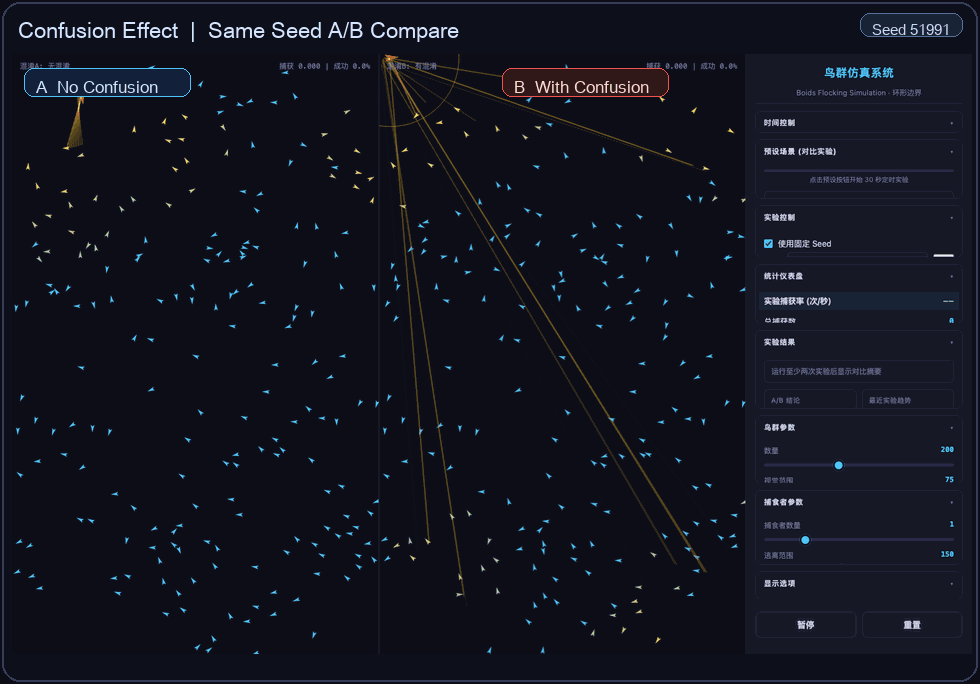
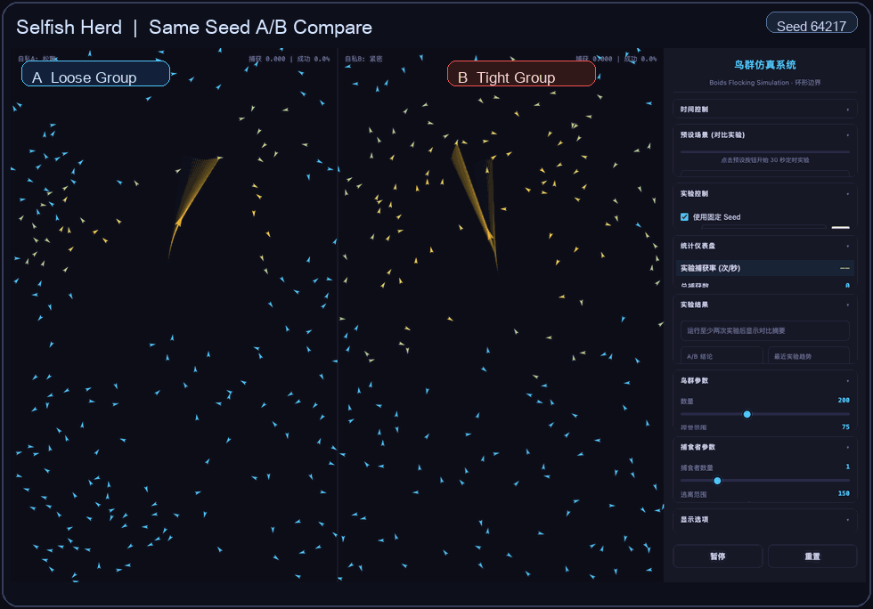

# 鸟群仿真系统（Boids Flocking Simulation）

一个基于 **Rust + WebAssembly + 原生 JavaScript + Canvas** 的交互式鸟群仿真项目，用于演示和对比群体在捕食压力下的行为机制。

项目支持四组 A/B 预设实验：

- 多眼效应（Many-Eyes）
- 稀释效应（Dilution）
- 混淆效应（Confusion）
- 自私兽群（Selfish Herd）

## 技术栈

- Rust（仿真核心）
- wasm-bindgen / wasm-pack（WASM 构建与 JS 绑定）
- JavaScript（UI 控制与渲染）
- HTML/CSS（页面与控制面板）

## 快速开始

### 1) 环境准备

- Rust 工具链（`rustc` + `cargo`）
- `wasm-pack`
- Python 3（用于本地静态服务器）
- 现代浏览器（Chrome / Firefox / Safari / Edge）

安装 `wasm-pack`（如未安装）：

```bash
cargo install wasm-pack
```

### 2) 编译 WASM

```bash
cd boids-wasm
wasm-pack build --target web --release
```

编译产物会输出到 `boids-wasm/pkg/`。

### 3) 启动本地服务

回到项目根目录后启动静态服务器：

```bash
python3 -m http.server 8080
```

浏览器打开：

`http://localhost:8080/web/`

## 使用说明

- 左侧是数据面板，中间是仿真画布，右侧是参数控制面板。
- 预设按钮只负责加载参数模板；正式实验通过 `运行 A/B 一次` 或 `批量运行 A/B` 触发。
- A/B 正式实验会在同一个 Seed 下成对运行，并直接记录 pair-level 结果。
- 支持暂停、重置、双画布展示 A/B、显示感知范围、尾迹、边缘高亮等可视化选项。

更详细的操作说明见：`docs/usage.md`

## 设计思路

这个项目的设计目标不是做一个通用 Boids 动画，而是做一个适合**课程展示 + 实验对比**的群体行为系统。整体设计围绕三个问题展开：

1. 如何让抗捕食机制“看得见”
2. 如何让 A/B 对比“可重复”
3. 如何让实验结果“能解释”

### 1. 系统结构

系统结构分为三层：

- Rust/WASM：负责鸟群与捕食者的状态推进、机制计算和统计输出
- 原生 JavaScript：负责实验控制、预设切换、结果记录和 A/B 对比逻辑
- Canvas：负责个体、目标锁定、事件残影和同屏对照可视化

当前仿真内核已经按职责拆分为 `flocking / predation / metrics / experiment` 四个部分，便于分别改进群体规则、捕食逻辑、统计指标和实验控制。



### 2. 机制可视化

README 里的 GIF 主要用于说明“为什么这个系统适合课题报告展示”，不是只展示动效。

#### 三条基础规则：分离、对齐、聚合

这三条规则是 Boids 模型的局部行为基础，也是后续四类抗捕食机制能够形成群体效应的底层前提。



`Separation / 分离`：个体在短距离内相互排斥，避免碰撞，决定了群体不会塌成一个点。



`Alignment / 对齐`：个体逐步调整速度方向，与邻近个体形成更一致的运动趋势。



`Cohesion / 聚合`：个体向局部群体中心靠拢，维持整体连贯性与群体形状。

#### 多眼效应：群体预警传播更快



观察点：

- 左侧 A 方案视野更窄、警报传播更弱
- 右侧 B 方案视野更宽、信息扩散更快
- 同 Seed 下更容易直接观察到“首次预警延迟”和“警戒覆盖率”的差异

#### 混淆效应：目标锁定更不稳定



观察点：

- 无混淆时，捕食者更稳定地保持锁定
- 有混淆时，目标切换更频繁，锁定更容易中断
- 可配合“平均锁定时长”和“平均混淆强度”一起解释

#### 自私兽群：紧密群体更容易形成中心保护



观察点：

- 松散群体的边缘暴露更明显
- 紧密群体会更快向局部安全区收缩
- 可结合“群体紧密度”和“边缘被捕比例”分析

### 3. 为什么这样设计

相比普通的单画布 Boids 演示，这个项目额外强化了三类能力：

- 建模层：加入方向性感知、警报传播、捕食者状态机和混淆强度
- 实验层：支持固定 Seed、单次/批量实验、结果记录和导出
- 展示层：支持同屏 A/B 对照、自动结论摘要、过程时间线和事件残影

因此它更适合用于：

- 课程作业展示
- 课题中期汇报
- A/B 参数实验演示
- 机制解释型报告配图

## 项目结构

```text
jisuanhuaxue/
├── boids-wasm/        # Rust + WASM 仿真内核
├── web/               # 前端页面与渲染逻辑
├── docs/              # 机制说明、预设参数、使用文档
├── LICENSE            # MIT License
└── README.md
```

## 文档索引

- `docs/usage.md`：运行与界面使用指南
- `docs/mechanisms.md`：四大抗捕食机制解释
- `docs/presets.md`：各预设参数与实验建议
- `docs/standard-preset.md`：现实参考标准预设与文献依据
- `docs/experiment-api.md`：无图形实验 API 与扫参入口
- `docs/improvements.md`：建模变更与功能变更记录（用于课题报告整理）

## 许可证

本项目采用 [MIT License](./LICENSE)。
